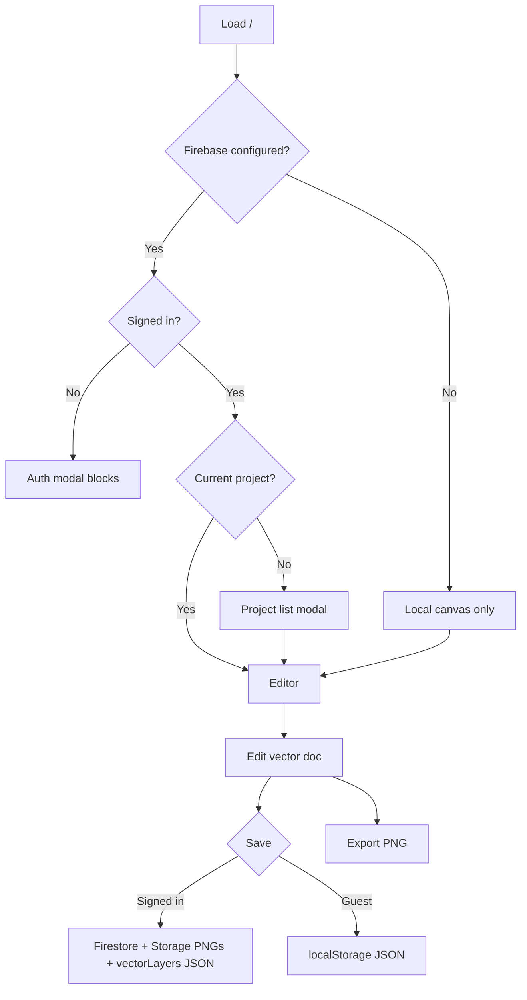

# spec.md — OpenPaint Product Specification

Authoritative product and roadmap document. For agent implementation rules, see `AGENTS.md`.

**Last aligned with codebase:** `dev` @ vector architecture (scene graph, `documentStore`, `VectorCanvas`). Older raster-only descriptions are obsolete.

---

## 1. Product overview

### Product promise

**The free, web-based vector design tool that is simple enough for anyone to start and capable enough for everyday screen graphics** — logos, icons, diagrams, and UI assets — without a subscription or install.

### Target users

- Hobbyists and students learning vector basics
- Developers and PMs who need quick diagrams or icons
- Designers who want a lightweight browser alternative for simple jobs
- Open-source contributors extending a Firebase-backed SPA

### Core workflows

1. **Start drawing** — Open app → (optional sign-in) → new or existing project → select tool → create/edit objects on canvas.
2. **Edit objects** — Selection tool → move, resize, nudge, adjust fill/stroke/opacity in Properties panel.
3. **Organize** — Layers for stacking; reorder layers; lock/hide layers.
4. **Iterate** — Undo/redo (operation-based history).
5. **Persist** — Sign in → cloud project with auto-save intent; or local JSON / `localStorage` without auth.
6. **Share output** — Export PNG composite.

### Product goals

- Ship a credible **vector** editor in the browser (editable objects, not burned pixels).
- Keep **time-to-first-stroke** low (minimal friction before canvas).
- Make **cloud save reliable** for signed-in users.
- Close gaps vs. table-stakes vector tools (pen, SVG, text UX) in small, shippable milestones.
- Stay maintainable: one scene graph, one active canvas path, retire dead raster code when safe.

---

## 2. Current application state

*Inferred from repository inspection unless noted as “declared in UI only”.*

### What the app does today

OpenPaint is a **single-route Next.js SPA** that edits a **vector document** (layers containing typed objects), renders it with Canvas 2D, and optionally syncs to Firebase. The main canvas is `VectorCanvas`; the older raster multi-canvas stack is **not wired** into `page.tsx`.

### Current feature inventory

| Feature | Status | Notes |
|---------|--------|-------|
| Vector object model | **Working** | `rectangle`, `ellipse`, `line`, `polygon`, `path`, `text`, `group` in `types/vector.ts` |
| Scene rendering | **Working** | `renderScene()` + transforms; solid + gradient fill types in renderer |
| Selection (V) | **Working** | Hit test, marquee, move, 8-handle resize, delete, keyboard nudge |
| Shapes R/O/L/polygon | **Working** | Create objects on drag; shift/alt modifiers in shape tool |
| Brush | **Working** | Freehand → smoothed path objects |
| Eraser | **Partial** | Deletes whole object under cursor, not partial erase |
| Fill (G) | **Partial** | Sets solid fill on object under cursor (not area flood fill) |
| Eyedropper (I) | **Working** | Samples object fill/stroke to tool defaults |
| Text (T) | **Minimal** | Browser `prompt()`; static font defaults |
| Properties panel | **Working** | Single-object: name, X/Y, W/H, rotation°, opacity, fill/stroke |
| Color picker | **Working** | Separate fill/stroke rows, presets, swap; applies to selection |
| Layers panel | **Working** | Vector layers only; up/down reorder; no object list |
| Undo/redo | **Working** | Operation-based, max 200, on `documentStore` |
| Zoom/pan | **Working** | Ctrl/meta + wheel; middle-mouse pan |
| PNG export | **Working** | White background composite |
| SVG export | **Not implemented** | |
| Pen tool (P) | **Not implemented** | No tool button |
| Direct selection (A) | **Not implemented** | |
| Groups UI | **Not implemented** | Model + renderer support `group` |
| Boolean/pathfinder | **Not implemented** | |
| Snapping / smart guides | **Not implemented** | |
| Gradient authoring UI | **Not implemented** | Renderer can draw gradients if set on object |
| On-canvas rotation handle | **Not implemented** | Rotation numeric in Properties only |
| Cloud projects | **Working** | CRUD, thumbnails, `vectorLayers` in Firestore |
| Auto-save | **Hook only** | 30s interval + 2s debounce; **`markDirty()` never called** — auto-save likely never triggers on edits |
| Local project JSON | **Working** | v2 `localStorage` / file open for `version` 2.x |
| Legacy raster load | **Gap** | Opening old PNG-only layer projects may show empty vector layers unless `vectorLayers` populated |
| Auth modal on load | **Strict** | If Firebase configured and signed out, modal blocks UI (not closable) |
| Tests | **None** | No automated test runner configured |
| Dark mode | **Not implemented** | |
| Mobile layout | **Not implemented** | Desktop-oriented sidebars |

### Current user flows

### Existing integrations

- **Firebase Auth** — Google popup, email/password, email link
- **Firestore** — `projects` collection per user
- **Firebase Storage** — per-layer PNG + thumbnail (derived from vector render on save)
- **Vercel** — typical Next.js deploy target (no `vercel.json` in repo; standard build)

### Current architecture summary

- **UI:** React 19 + Tailwind v4, one page shell with toolbars and panels.
- **State:** Zustand — `documentStore` (scene + history), `canvasStore` (tools/view + legacy raster state), `projectStore`, `authStore`.
- **Render loop:** React effect re-renders main canvas when layers change; overlay updated imperatively during drags.
- **Persistence:** Dual write — JSON scene in `vectorLayers` + rasterized layer PNGs for thumbnails/previews.

### Existing technical constraints

- Client-only Firebase; 4096×4096 canvas cap in Firestore rules.
- Storage uploads `image/png` only (rules).
- All `NEXT_PUBLIC_` env vars exposed to browser.
- No service worker / offline-first.
- Single page — no project dashboard route.

### Known limitations

1. **Auto-save dirty flag** — `markDirty()` defined but never invoked; status bar “unsaved” may not reflect edits; debounced auto-save may not run.
2. **Auth blocks guest creativity** — When Firebase is configured, unsigned users see a mandatory auth modal (differs from “instant start” goal in prior planning docs).
3. **Text UX** — `prompt()` only; no re-edit on canvas.
4. **Eraser / fill semantics** — Object-level, not pixel/raster behavior users may expect from paint apps.
5. **Toolbar Clear** — Clears legacy raster canvas, not vector document.
6. **Dead raster code** — `DrawingCanvas`, `useDrawing`, `useHistory`, `floodFill` increase confusion and bundle surface.
7. **Save cost** — Full layer PNG re-upload every save.
8. **Legacy projects** — Pre-vector saves without `vectorLayers` may load empty layers (metadata only).
9. **No automated tests** — Regressions caught manually or via build only.

---

## 3. Product roadmap

Ordered by **user value** and **dependency**. Each item is sized for one focused commit sequence on `dev`.

### Milestone 1 — Cloud save actually auto-saves

**User value:** Signed-in users trust that work is saved without pressing Save.

**Acceptance criteria:**

- After any undoable document change (add/modify/remove object or layer), `isDirty` becomes true and debounced save runs within ~2s when authenticated.
- Status bar shows “Unsaved changes” until sync completes, then “Saved”.
- Manual Save still works.

**Implementation intent:** Call `markDirty()` from `documentStore` mutations and/or `pushHistory` completion; avoid marking dirty on load. Verify `useAutoSave` debounce path.

---

### Milestone 2 — Guest-first canvas (optional auth)

**User value:** New visitors can draw immediately; sign-in is for cloud features only.

**Acceptance criteria:**

- With Firebase configured, unsigned users reach a blank (or last local) canvas without a blocking modal.
- Dismissable banner: “Sign in to save to the cloud” with action to open auth.
- Auth modal appears when user chooses Open Cloud Projects, Save to cloud, or equivalent — not on first paint.

**Implementation intent:** Adjust `page.tsx` modal gating; keep project list behind auth.

---

### Milestone 3 — Inline text editing

**User value:** Text is usable for real designs, not a browser prompt.

**Acceptance criteria:**

- Click with Text tool places an on-canvas editable field (respects zoom/pan).
- Typing updates a `text` object; Escape or click outside commits.
- Double-click existing text with Selection tool re-enters edit mode.
- Font size/family from `BrushSettings` / Properties apply to new and edited text.

**Implementation intent:** DOM overlay or contenteditable positioned in `VectorCanvas`; remove `prompt()`.

---

### Milestone 4 — Layers panel shows objects

**User value:** Users can find, select, and reorder artwork without hunting on canvas.

**Acceptance criteria:**

- Active layer expands to list object names (or type + truncated name).
- Click row selects object on canvas; selection highlights row.
- Delete/visibility/lock respected from object flags.

**Implementation intent:** Extend `LayersPanel` from `documentStore`; optional drag-reorder objects within layer.

---

### Milestone 5 — SVG export

**User value:** Users can hand off vectors to other tools and the web.

**Acceptance criteria:**

- Export menu or toolbar action downloads `.svg` of visible document.
- Supports at least: rect, ellipse, line, path, text (as `<text>`), groups.
- Solid fills and strokes map correctly; transforms applied.

**Implementation intent:** New `src/lib/vector/svgExport.ts` walking scene graph; share types with renderer.

---

### Milestone 6 — Pen tool (basic)

**User value:** Users can draw custom paths like every vector app.

**Acceptance criteria:**

- Tool P in toolbar and shortcuts.
- Click adds corner points; click-drag adds smooth points with handles; Enter/Escape finishes open path; click start closes path.
- Live preview segment to cursor.
- Result is editable `path` object in scene graph.

**Implementation intent:** New `usePenTool` hook + overlay preview; pathdiv not required for v1.

---

### Milestone 7 — Open legacy raster projects

**User value:** Existing users do not lose work when opening old cloud saves.

**Acceptance criteria:**

- On load, if `vectorLayers` empty but Storage layer PNGs exist, import each PNG as a `rectangle` or locked `path`/image placeholder layer (documented approach: one image object per layer) **or** rasterize into a single locked background object.
- Thumbnail and save round-trip still work.

**Implementation intent:** In `loadProject`, fetch Storage URLs and build objects; prefer one `path` with embedded image draw or explicit `image` type if added.

*Note: Adding an `image` object type is acceptable if smaller than full raster engine revival.*

---

### Milestone 8 — Group / ungroup

**User value:** Users manage multi-shape selections as one unit.

**Acceptance criteria:**

- Ctrl+G groups selection into `group` object; Ctrl+Shift+G ungroups.
- Move/resize applies to group bounds.
- Layers panel shows group expandable (depends Milestone 4).

**Implementation intent:** `documentStore` group ops + history batch entries.

---

### Milestone 9 — Direct selection (anchor edit)

**User value:** Users refine paths after creation.

**Acceptance criteria:**

- Tool A selects anchors on one `path` at a time.
- Drag anchor moves; drag handle adjusts curve; double-click segment adds point; Delete removes anchor.

**Implementation intent:** `useDirectSelectionTool` + overlay anchor rendering.

---

### Milestone 10 — Remove raster dead path

**User value:** Faster loads, fewer agent mistakes, smaller mental model.

**Acceptance criteria:**

- No imports of `DrawingCanvas` / `useDrawing` / `useHistory` from active UI.
- Toolbar Clear clears active vector layer objects (with confirm).
- Build and lint pass.

**Implementation intent:** Delete or archive unused files; trim `canvasStore` raster APIs if unreferenced.

---

### Later (not next queue)

- Gradient fill UI, boolean ops, snapping, command palette, JPEG export, project dashboard route, dark mode, responsive layout, real-time collaboration.

These are **not** invented new product directions; they appear in prior planning (`competitor-analysis.md` archive) and partial code (gradient types, group type).

---

## 4. Out of scope (unchanged intent)

| Area | Reason |
|------|--------|
| CMYK / print prepress | Web RGB focus |
| AI generative features | Infra cost; not core |
| Real-time multiplayer | Large architecture change |
| Full Illustrator parity | 35 years of scope creep |

---

## 5. Related documents

| File | Role |
|------|------|
| `AGENTS.md` | Agent instructions, commands, git workflow |
| `README.md` | Human quick start |
| `competitor-analysis.md` | Archived market reference (pointer only) |
| `deps-verified.md` | Archived dependency note (pointer only) |
